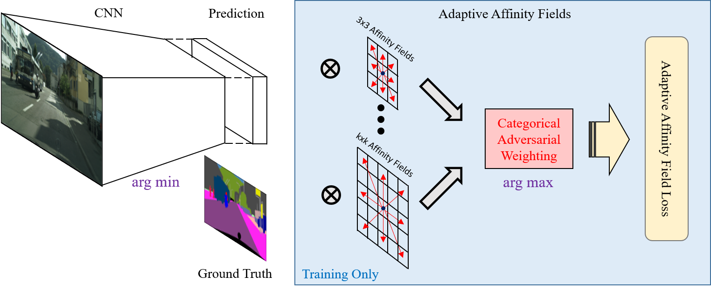

# Adaptive Affinity Fields for Semantic Segmentation

By [Tsung-Wei Ke*](https://www1.icsi.berkeley.edu/~twke/), [Jyh-Jing Hwang*](https://jyhjinghwang.github.io/), [Ziwei Liu](https://liuziwei7.github.io/), 
and [Stella X. Yu](http://www1.icsi.berkeley.edu/~stellayu/) (* equal contribution)



Semantic segmentation has made much progress with increasingly powerful pixel-wise classifiers and incorporating structural 
priors via Conditional Random Fields (CRF) or Generative Adversarial Networks (GAN). We propose a simpler alternative that 
learns to verify the spatial structure of segmentation during training only. Unlike existing approaches that enforce semantic 
labels on individual pixels and match labels between neighbouring pixels, we propose the concept of Adaptive Affinity Fields 
(AAF) to capture and match the semantic relations between neighbouring pixels in the label space. We use adversarial learning 
to select the optimal affinity field size for each semantic category. It is formulated as a minimax problem, optimizing our 
segmentation neural network in a best worst-case learning scenario. AAF is versatile for representing structures as a collection 
of pixel-centric relations, easier to train than GAN and more efficient than CRF without run-time inference. Our extensive evaluations 
on PASCAL VOC 2012, Cityscapes, and GTA5 datasets demonstrate its above-par segmentation performance and robust generalization across 
domains. 

AAF is published in ECCV 2018, see [our paper](https://arxiv.org/abs/1803.10335) for more details.

* Multi-GPU SyncBatchNorm has been released!

## Prerequisites

1. Linux
2. Python2.7 or Python3 (>=3.5)
3. Cuda 8.0 and Cudnn 6

## Required Python Packages

1. tensorflow 1.4 (for versions >= 1.6 might cause OOM error)
2. numpy
3. scipy
4. tqdm
5. PIL
6. opencv

## Data Preparation

* [PASCAL VOC 2012](http://host.robots.ox.ac.uk/pascal/VOC/voc2012/)
* [Cityscapes](https://www.cityscapes-dataset.com/)

## ImageNet Pre-Trained Models

Download ResNet101.v1 from [Tensorflow-Slim](https://github.com/tensorflow/models/tree/master/research/slim).

## Training

* Baseline Models:
```
python pyscripts/train/train.py
```

* Baseline Models (Multi-GPUs):
```
python pyscripts/train/train_mgpu.py
```

* Affinity
```
python pyscripts/train/train_affinity.py
```

* Affinity (Multi-GPUs)
```
python pyscripts/train/train_affinity_mgpu.py
```

* AAF
```
python pyscripts/train/train_aaf.py
```

* AAF (Multi-GPUs)
```
python pyscripts/train/train_aaf_mgpu.py
```

## Inference

* Single-Scale Input only
```
python pyscripts/inference/inference.py
```

* Multi-Scale Inputs and Left-Right Flipping (opencv is required)
```
python pyscripts/inference/inference_msc.py
```

## Benchmarking

* mIoU
```
python pyscripts/benchmark/benchmark_by_mIoU.py
```

* instance-wise mIoU
```
python pyscripts/benchmark/benchmark_by_instance.py
```

See our [bash script examples](/bashscripts/) for the corresponding input arguments.

## Citation
If you find this code useful for your research, please consider citing our paper [Adaptive Affinity Fields for Semantic Segmentation](https://arxiv.org/abs/1803.10335).

```
@inproceedings{aaf2018,
 author = {Ke, Tsung-Wei and Hwang, Jyh-Jing and Liu, Ziwei and Yu, Stella X.},
 title = {Adaptive Affinity Fields for Semantic Segmentation},
 booktitle = {European Conference on Computer Vision (ECCV)},
 month = {September},
 year = {2018} 
}
```

## License
AAF is released under the MIT License (refer to the LICENSE file for details).
